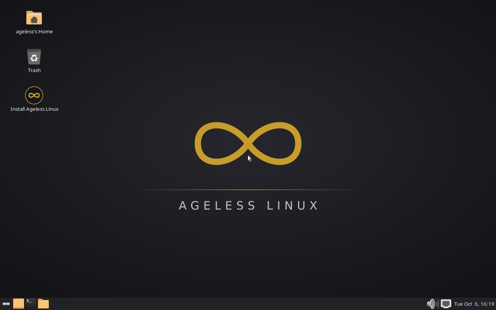
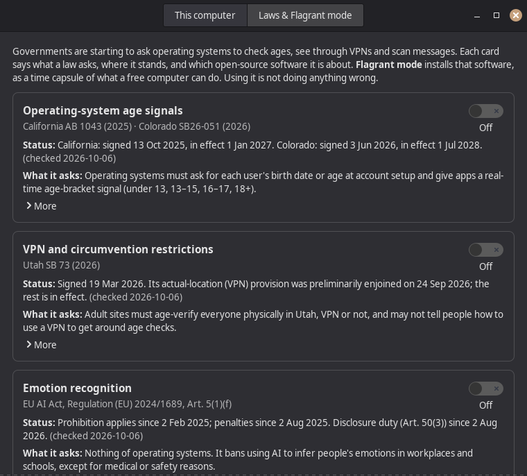

# ageless-iso — build Ageless Linux

This directory turns Debian 13 "trixie" into **Ageless Linux 0.1 "Timeless"**,
an installable distribution: a MATE desktop in the Linux Mint style on a
Debian base (think LMDE with MATE). The ISOs carry the same refusal of
California AB 1043 age verification as `become-ageless.sh`.



*The live session, captured by `tests/smoke.py`: MATE with mintmenu and
Mint-Y-Dark-Sand; [with the menu open](docs/screenshots/live-menu.png).
Boot menus: [UEFI/GRUB](docs/screenshots/boot-uefi-grub.png),
[BIOS/isolinux](docs/screenshots/boot-bios-isolinux.png).*

One command builds everything inside a pinned container. The host needs
only Python 3 and Podman or Docker.

```bash
./build.py --variant live                 # live ISO: MATE desktop + Calamares installer
./build.py --variant netinst              # netinstall ISO: stock debian-installer + preseed
./build.py --variant live --flagrant      # flagrant mode (ageless-refusal)
./build.py --variant packages             # just the .debs (out/debs/) and an apt archive (out/repo/)
./build.py --variant packages --release   # insist on a release build (clean checkout on tag v<version>)
./build.py --variant live --dry-run       # show the container commands
tools/release.py version                  # the version this checkout builds, e.g. 0.1.0~31.gd4fb9c3
```

Output goes to `out/`: the ISO, its `.sha256`, the package manifest and the
build log. Boot-test it with:

```bash
docker run --rm --device /dev/kvm -v $PWD:/src:ro -v $PWD/out:/out localhost/ageless-build:trixie \
    python3 /src/tests/smoke.py /out/ageless-timeless-0.1-amd64-live.iso
```

## What gets built

| Product | Tool | Audience |
|---|---|---|
| `ageless-timeless-0.1-<arch>-live.iso` | live-build + Calamares | Everyone. It boots to an Ageless MATE desktop with "Install Ageless Linux" on it. |
| `ageless-timeless-0.1-<arch>-netinst.iso` | simple-cdd + stock d-i | People who know debian-installer. About 700 MB. Until `apt.agelesslinux.org` exists it is built as a DVD-type image, so the Ageless and Mint packages and the MATE core install offline. Everything else comes from the Debian mirror. |

Packages (in `packages/`, built by `tools/build-packages.sh`):

| Package | What it does |
|---|---|
| `ageless-os-release` | Diverts `/usr/lib/os-release`: `ID=ageless`, `ID_LIKE=debian`, `VERSION_CODENAME=timeless`, `DEBIAN_CODENAME=trixie` |
| `ageless-compliance` | Standard mode: `/etc/ageless/ab1043-compliance.txt` plus the nonfunctional age-verification API |
| `ageless-refusal` | Flagrant mode: the refusal statement and `/etc/ageless/REFUSAL`. Conflicts with `ageless-compliance`. |
| `ageless-agelessd` | 24-hour timer that neutralizes systemd userdb `birthDate`. Does nothing unless `systemd-userdbd` is installed. |
| `ageless-standard` / `ageless-flagrant` | Metapackages for the two stances |
| `ageless-desktop-mate` | Wallpaper, Mint-style panel layout, theme and font defaults, slick-greeter config, `ageless-desktop-reset` |
| `ageless-system-info` | **Ageless System Info**: system facts plus *Laws & Flagrant mode*, a dated, sourced catalog of laws aimed at operating systems, each with a switch that installs its "time capsule" ([docs/laws.md](docs/laws.md)). Also the `ageless-flagrant` CLI. |
| `ageless-flagrant-vpn` / `-vision` / `-crypto` | The time capsules: VPN and anonymity tools; computer-vision building blocks; encryption tools. Archive only. |
| `ageless-maker` | Metapackage of maker tools (Arduino, KiCad, FreeCAD, slicers, serial terminals). In the archive, not on the ISO. |
| `ageless-device` | Ageless Device (RP2040/RP2350) support: udev rules and the `ageless-device` CLI ([docs/ageless-device.md](docs/ageless-device.md)). Archive only. |
| `ageless-keyring` | Archive key + apt source. Built once `keys/archive.asc` exists ([docs/upgrades.md](docs/upgrades.md)). |
| `mintmenu` | **Our fork** of Linux Mint's menu, a git subtree with Debian fixes ([docs/mintmenu.md](docs/mintmenu.md)) |
| `calamares-settings-ageless` | Fork of `calamares-settings-debian` with Ageless branding |



## Layout

```
build.py                    one entrypoint (stdlib Python)
common/release.env          name, version, codename, Debian suite, snapshot pin
containers/Containerfile.build
packages/                   our Debian source packages
variant-live/               live-build config + build-inner.sh
variant-netinst/            simple-cdd profile + build-inner.sh
upstream/rebuilds.toml      Mint/MATE packages we rebuild unchanged (tools/rebuild.py)
tools/make-repo.py          apt archive: build, sign, serve (dev loop)
tests/                      QEMU smoke test, package install/upgrade test, unit tests
docs/                       roadmap, MATE/Mint research, fork guide
```

CI is `.github/workflows/ageless-iso.yml` at the repo root. It runs lint,
builds the .debs, builds the {live, netinst} × {amd64, arm64} ISOs, runs the
QEMU smoke test, and creates a draft release on `v*` tags.

## Known gaps

- **No Secure Boot**: disable it to boot the ISO (roadmap §2).
- **No archive key yet.** Everything for a signed archive is in place
  (`tools/new-archive-key.py`, `ageless-keyring`, the CI publishing job),
  but it waits on a key and on Pages being enabled. Until then, use the
  development loop in [docs/upgrades.md](docs/upgrades.md) to upgrade an
  installed system.
- The d-i image skips **32-bit UEFI** boot. simple-cdd 0.6.9 still expects
  i386 installer images, which trixie no longer ships; `variant-netinst/build-inner.sh`
  works around this and fails loudly once upstream fixes it.
- **arm64** builds in CI but is experimental. Debian itself publishes no
  arm64 live images.
- The live ISO's boot menu carries the Ageless splash. The **d-i image's** boot
  menu and installer screens are still stock Debian; that is the roadmap's
  Phase 2 `ageless-installer-theme` (rootskel-gtk + debian-cd splash) work.
- `/etc/issue` still says Debian, until we fork base-files.

See [docs/ROADMAP.md](docs/ROADMAP.md) for the plan,
[docs/upgrades.md](docs/upgrades.md) for upgrading installed systems,
[docs/mintmenu.md](docs/mintmenu.md) for the menu fork,
[docs/laws.md](docs/laws.md) for Laws & Flagrant mode,
[docs/ageless-device.md](docs/ageless-device.md) for the device,
[docs/mate-and-mint.md](docs/mate-and-mint.md) for the desktop work and
[docs/gotchas.md](docs/gotchas.md) for everything that broke along the way.
