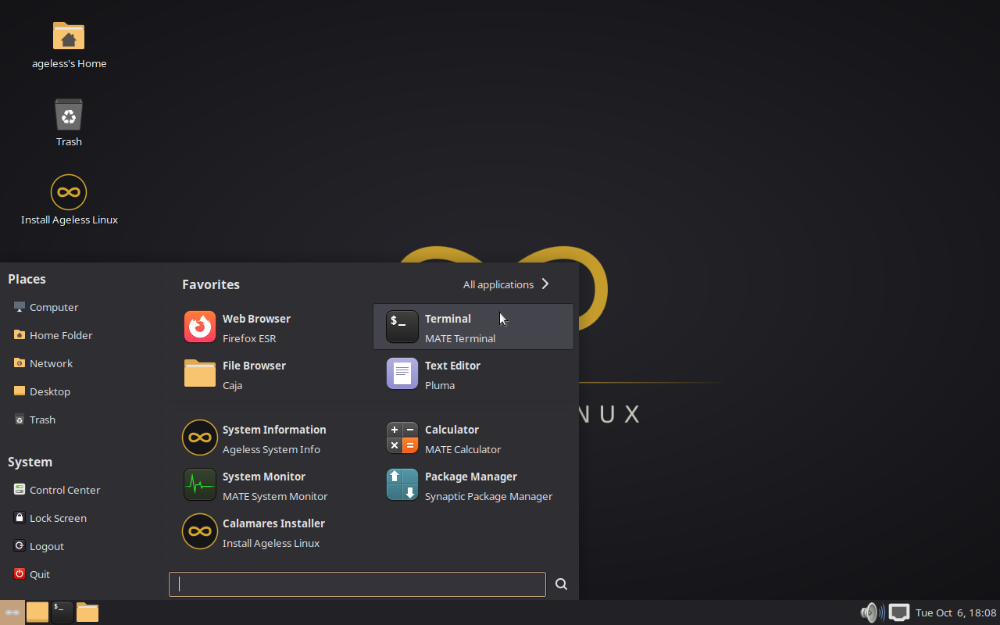

# Forking mintmenu: owning the desktop's front door

> Draft for the blog. Every command here was run on the Ageless Linux tree;
> the paths are real.



*The Ageless live session with the menu open, captured by `tests/smoke.py`
(it taps Super through the QEMU monitor).*

On a desktop distro, the menu is the operating system's face. People open
it to start a browser or a terminal, and after that the OS is out of the
way. So for Ageless Linux, "doing desktop development" mostly means one
thing: owning the menu. We use Linux Mint's **mintmenu** on MATE, and we
keep its source in our own tree so we can rebuild, change and extend it.

Desktop development has a reputation for being hard. Most of that
reputation comes from build systems and C toolkits. mintmenu is under 5,000 lines
of **Python 3 + GTK 3** talking to the MATE panel through GObject
introspection. If you can write a Python script, you can change your
desktop's menu.

## How a MATE panel applet works

The MATE panel doesn't link the menu in; it starts it as a separate process
and embeds its window. Three small files make that happen:

| File | Purpose |
|---|---|
| `/usr/share/mate-panel/applets/org.mate.panel.MintMenuApplet.mate-panel-applet` | Tells the panel an applet factory called `MintMenuAppletFactory` exists, and which applet (`MintMenuApplet`) it makes. |
| `/usr/share/dbus-1/services/org.mate.panel.applet.MintMenuAppletFactory.service` | D-Bus activation: when the panel asks for that factory, D-Bus runs `/usr/lib/linuxmint/mintMenu/mintMenu.py`. |
| `/usr/lib/linuxmint/mintMenu/mintMenu.py` | Calls `MatePanelApplet.Applet.factory_main("MintMenuAppletFactory", …)`, then builds the button and the menu window in GTK. |

A panel *layout* puts the applet on the panel. Ours is
`/usr/share/mate-panel/layouts/ageless.layout`
(`packages/ageless/desktop/ageless.layout`):

```ini
[Object menu]
object-type=applet
applet-iid=MintMenuAppletFactory::MintMenuApplet
toplevel-id=bottom
position=0
```

That is all it takes to replace MATE's stock menu: no patch to
mate-panel. `ageless-desktop-mate` sets `ageless` as the default layout
through a GSettings override, and mate-tweak lists it.

Inside the menu, everything is a **plugin**: a Python module with a
`pluginclass` that fills a GTK container. The panes you see (places,
system buttons, applications with favourites and search, recent files) are
the modules in `/usr/lib/linuxmint/mintMenu/plugins/`, listed in the
`com.linuxmint.mintmenu plugins-list` setting. mintmenu also puts
`~/.linuxmint/mintMenu/plugins/` on the import path. That is the extension
point for Ageless panes, such as an Ageless Device pane, without touching
upstream files.

## Getting the source in hand

mintmenu lives at https://github.com/linuxmint/mintmenu. Two details matter.
First, Mint stopped tagging releases at 5.9.0, which is still Python 2;
current versions exist only as commits on `master`. Second, the repo already
contains its own `debian/` directory, so `dpkg-buildpackage` works out of
the box.

We vendor it as a **git subtree**, squashed to one commit, inside our
monorepo:

```bash
git subtree add --prefix=ageless-iso/packages/mintmenu --squash \
    https://github.com/linuxmint/mintmenu.git b0ff4eb20c1e670d93a966e3d80d4374f25f0a1b
```

`b0ff4eb` is 6.2.3, the version LMDE 7 ships. A subtree rather than a
separate fork repo means:

- `./build.py` builds it like any of our packages (`packages/*/` are all
  built), and CI tests it with the ISO;
- a menu change is one commit in one repo, reviewable next to the panel
  layout and theme it goes with;
- there is no submodule step to forget when cloning.

Pulling a newer upstream later is one command, and our changes merge on top:

```bash
git subtree pull --prefix=ageless-iso/packages/mintmenu --squash \
    https://github.com/linuxmint/mintmenu.git master
```

If the fork ever deserves its own repository, `git subtree split
--prefix=ageless-iso/packages/mintmenu` produces one with full history.

## What was Mint-only, and the fixes

All of mintmenu's dependencies are in Debian main. Some features, though,
call Mint tools that don't exist on Debian, and they **fail silently**: you
click and nothing happens. Grepping for every external command
(`grep -rn "Execute\|subprocess\|os.system" plugins/`) found four, and a
screenshot of the open menu found a fifth:

| Feature | Upstream calls | On Debian | Ageless fix |
|---|---|---|---|
| Right-click → **Uninstall** | `mint-remove-application` (mintcommon) | missing | `apt-helper.py remove-desktop-file`: finds the owning package with `dpkg-query -S`, simulates `apt-get remove`, shows what would go, asks, runs it through `pkexec`. Refuses if the desktop itself would be removed. |
| Search → **Install package 'foo'** | `xdg-open apt://foo` (mintinstall/apturl) | no `apt:` handler | Uses the `apt:` handler if one is installed, else `apt-helper.py install foo`. |
| Search → Find Tutorials / Hardware / Ideas / Users | community.linuxmint.com | Mint-only content | Dropped. **Find Software** searches packages.debian.org for the Debian base suite (`DEBIAN_CODENAME` from os-release, the LMDE convention). |
| Search and "All applications" icons | `xsi-*` icons (6.2.3 switched to XApp Symbolic Icons) | not in Debian: broken-image placeholders | Rebuild [xapp-project/xapp-symbolic-icons](https://github.com/xapp-project/xapp-symbolic-icons) 1.1.0 (`upstream/rebuilds.toml`) and depend on it. Found from the smoke test's menu screenshot. |
| Default favourites | Mint's app list | mostly absent | Ageless list: Firefox ESR, terminal, files, text editor; Thonny, Arduino, KiCad, FreeCAD when installed; Ageless System Info, the installer. |

`apt-helper.py` is new in our tree. Upstream files carry short
`# Ageless:` comments where they changed, so `git log -p` on the subtree
shows the whole fork as a handful of readable patches.

Packaging changes: `debian/changelog` gets a `6.2.3+ageless1` entry (the
`+ageless1` sorts above Mint's 6.2.3, so our build replaces it), and
`debian/control` names us as maintainer while keeping Clement Lefebvre as
`XSBC-Original-Maintainer`. `ageless-desktop-mate` depends on
`mintmenu (>= 6.2.3+ageless1~)` (the `~` admits its development builds), so an
upgrade always brings the fork.

## The edit–test loop

You don't need to rebuild an ISO, or even a package, to try a menu change.

**On a running Ageless system, straight in place** (fastest; changes are lost
on the next package upgrade):

```bash
sudo nano /usr/lib/linuxmint/mintMenu/plugins/applications.py
pkill -x mintmenu; mate-panel --replace &   # restart the menu process and the panel
```

mintmenu is started by D-Bus activation, so its output, Python tracebacks
included, goes to the user session log:

```bash
journalctl --user -f        # or ~/.xsession-errors, depending on the session setup
```

**As a package, the way it ships.** On the build machine:

```bash
./build.py --variant packages                # builds every package, mintmenu included
python3 tools/make-repo.py serve             # serves out/debs on port 8642
```

On the Ageless laptop (one-time `ageless-dev.list` setup in
[upgrades.md](upgrades.md)):

```bash
sudo apt update && sudo apt full-upgrade
ageless-desktop-reset                         # re-apply the panel layout, restart the panel
```

Each development build gets a version like
`6.2.3+ageless1~31.gd4fb9c3`, so apt always sees it as an
upgrade.

## Ideas for what's next

- **An Ageless Device pane**: a plugin in `plugins/` that lists connected
  devices (`ageless-device list`) and their apps.
- **"Find Software" → the Ageless Store** once it exists, and a Software
  button in the system pane (upstream only shows one when `mintinstall`
  exists).
- **Translations**: `po/` comes along with the subtree. Our new strings
  (`apt-helper.py`) aren't in `mintmenu.pot` yet.
- **Send fixes upstream.** The Debian fallbacks are generic. Upstream
  would likely accept them, which shrinks our diff.
